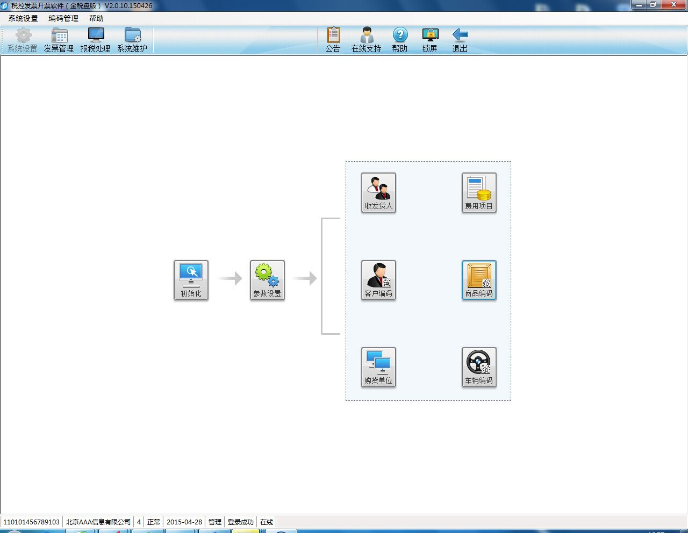
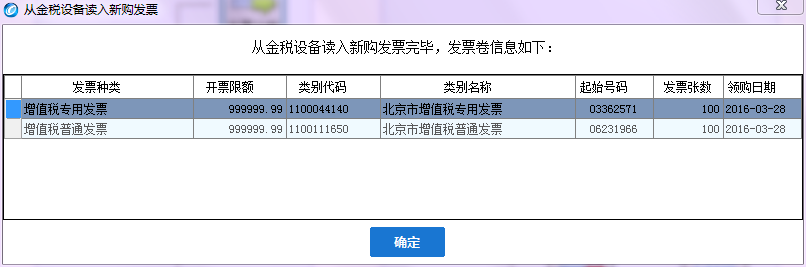
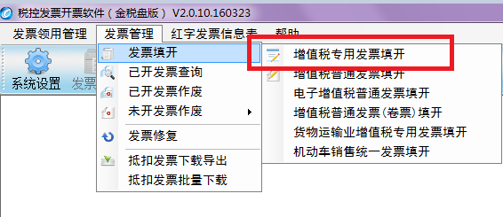
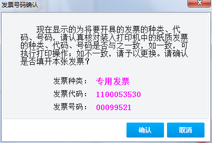
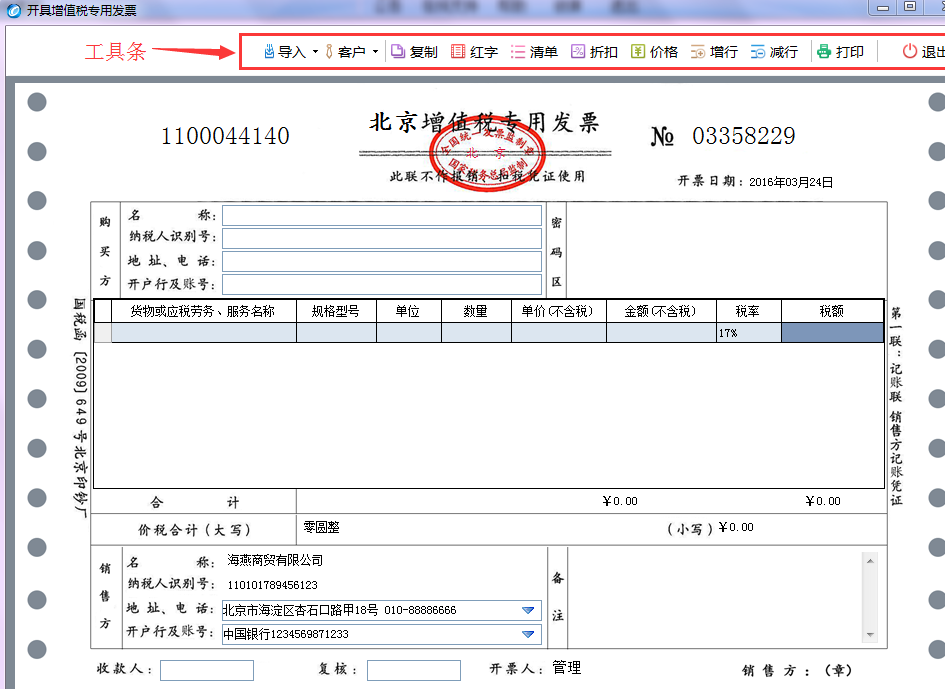

#开具发票四步走（金税盘版）

###**一、登录系统**

把金税盘与电脑主机相连，双击桌面上的“开票软件”快捷图标，在“用户名”一栏的下拉列表框中选择一个用户，在“密码”栏中输入密码，点击“登录”按钮，进入系统主界面，如图：

###**二、发票读入**

新从税局领用的发票，需要进行读入企业端开票系统操作。

点击“发票管理/发票领用管理/读入新购发票”菜单项，系统弹出“您确定要从金税设备读取发票吗？”提示信息框，单击“是”按钮，然后选择读入发票来源介质（金税盘或报税盘）（如果没有注册报税盘则不会有此提示），系统便读取金税设备购票信息。如果读入成功，则购票信息记入本机金税盘中，并显示发票读入成功的提示信息。如图：

###**三、发票填开**

点击“发票管理/发票填开/增值税专用发票填开”菜单项，系统弹出“发票号码确认”提示框。

点击“确认”按钮，系统弹出“增值税专用发票填开”窗口。

    1、填写购方信息

方法一：客户编码库中取数据。点击“名称”或“纳税人登记号”编辑框右侧的按钮，便弹出“客户选择”窗口，选取一个客户并双击，则本条客户信息便写入发票界面的购方信息栏。

方法二：直接填写。“名称”项最大长度为100个数字字母或50个汉字；“税号”可以为6-20位的数字或字母，普票税号可以为空；“地址电话”与“开户行及账号”均可打印100个数字字母或50个汉字。名称和纳税人识别号均支持模糊查询匹配以便于用户输入。

    2、填写商品信息

第一种：不带清单和折扣的发票：

（1）点击“商品名称”编辑框右侧的按钮，便弹出“商品编码选择”窗口，用户可从中选取一种商品，然后双击之或点击工具条上的“选择”按钮，则本条商品的名称、规格型号、单位、单价和税率等信息便写入发票界面的商品信息行。其中“单价”数值可以修改，“税率”可从下拉框中选择“0%、1.5%、3%、4%、5%、6%、11%、13%、17%、中外合作油气田”等税率。中外合作油气田版发票只能通过此处选择“中外合作油气田”税率来开具。

（2）在“数量”一栏填写销售本商品的数量，然后按“回车”键，系统会自动计算出金额、税额和价税合计金额。

（3）如选择的商品没有赋予税收分类编码，则会弹出商品编码添加窗口，添加税收分类编码保存后，方可正常调用此商品编码，此类商品如果享受优惠政策，在“享受优惠政策”选项选择“是”，在“优惠政策类型”选择对应的类型，例如：“免税”，税率会自动调整为匹配的优惠税率，不享受优惠政策的商品类，“享受优惠政策”项为灰色不可选。

第二种：带折扣的发票：

当企业在业务上需要及时融资或因产品质量等问题要对所销货物进行折扣处理时，就要用到本系统提供的折扣功能开具带折扣的发票。

（1）利用第一种填开商品信息的方法开具若干行商品后，首先选中欲加折扣的某个商品行或多行商品行的最后一行，然后点击工具条上的折扣按钮（若本商品行处于编辑状态或不允许加折扣则该按钮被禁用），便弹出“折扣”对话框，

（2）在此窗口的折扣行数框中填写从当前选中行向上几行（含本行）商品需要统一加折扣，然后在折扣率或折扣金额处输入所要折扣的数值，确认后即可对一行或多行商品加折扣。例如，在折扣行数处输入“2”，则代表从当前选中行向上的2行商品（含本行）都按本折扣率或折扣金额进行折扣。

第三种：带销货清单的发票：

在填开发票时，当客户所购商品的种类或项目较多，商品行超过本类别发票所允许的最大开具行数时，可利用系统提供的销货清单的功能来开具带销货清单的发票。

（1）进入发票填开界面后，直接点击工具条上的清单按钮，在系统弹出的“销货清单填开”窗口中添加商品。

（2）利用第一种填开商品信息的方法将清单填写完毕，点击工具条上的“完成”按钮，返回到发票填开界面。此时，商品信息表中出现“清单行”，所有栏目则不允许修改。

    3、填写销方信息

销方信息中企业名称、纳税人登记号和地址、电话均由系统自动从金税盘和系统参数设置中的企业税务信息中提取，开票时不能修改，只有开户行及账号可以修改。如果该企业有多个账号，可以点击开户行及账号右侧的箭头，从多个账号中任选一个即可。

###**四、发票打印**
当发票填写完毕且检查无误时，请点击工具条上的打印按钮，则系统首先将所开发票信息记入金税盘与开票软件数据库，随后便弹出“发票打印”对话框，在此处，可以设置纸张打印边距、预览打印效果、实施打印，也可以取消打印（待以后在进行发票查询时打印）。